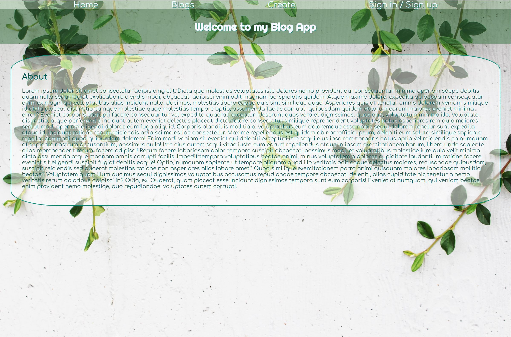
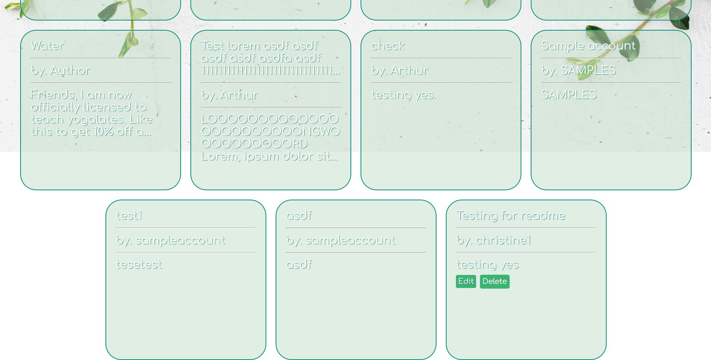
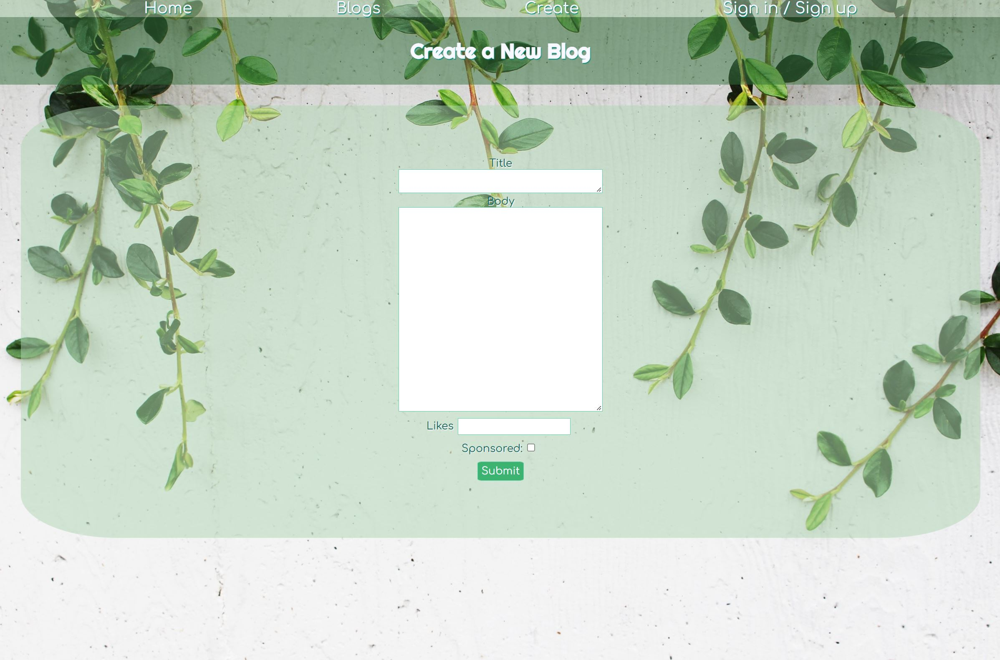

# perscholas-blogapp
https://christineblogapp.herokuapp.com/

** Heroku free plan is announced to be end on November 28, 2022. New URL will be updated soon.

## Description
This project is a practice of building a CRUD app with Mongoose in a form of the blog using React js. In this app, user is able to do the following: 
- Sign up, log in and log out
- Create a new blog post
- Read all blog posts
- Edit and update the blog post
- Delete the blog post

**All users can access the website and read the blogs. But, create, edit, and delete button is enabled to the logged-in users only.

## Image

### Tech Stack
- React js
- CSS
- Node js
- Express
- MongoDB

### Future Improvements
- Show log in status
- Filter and sort user's posts